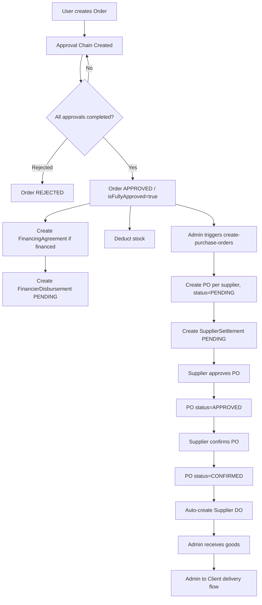

# Order to PO to DO Flow

This document describes the operational flow from **Order** to **Purchase Order (PO)** to **Delivery Order (DO)** in EPP.

---

## High-level flow

---

## Detailed steps

1. **Order creation**
   - Source: checkout or direct order create
   - Result:
     - `Order` + `OrderItem` records created
     - status starts at `PENDING_APPROVAL`

2. **Approval workflow**
   - Approvers process each level
   - If all approved:
     - `Order.status = APPROVED`
     - `Order.isFullyApproved = true`
   - If rejected:
     - `Order.status = REJECTED`

3. **Financing branch (if order uses financing)**
   - Create `FinancingAgreement` snapshot
   - Update financier credit (`usedCredits`, `availableCredits`)
   - Auto-create `FinancierDisbursement` with `PENDING` status

4. **Stock update**
   - On approval finalization, deduct `Item.stockQuantity`
   - Low-stock checks can trigger supplier notifications

5. **Create Purchase Orders**
   - Endpoint: `POST /api/order/:id/create-purchase-orders`
   - Logic:
     - Group order items by supplier
     - Create one `PurchaseOrder` per supplier (`PENDING`)
   - After each PO:
     - Auto-create `SupplierSettlement` (`PENDING`)

6. **PO supplier actions**
   - Supplier approves PO -> status `APPROVED`
   - Supplier confirms PO -> status `CONFIRMED`
   - On confirm:
     - auto-create supplier `DeliveryDocument` (DO)

7. **Delivery flow**
   - Supplier DO to Admin
   - Admin receives goods
   - Admin fulfills and delivers to client/HR as per document stages

---

## Main statuses by entity

### Order
- `PENDING_APPROVAL` -> `APPROVED` or `REJECTED`

### PurchaseOrder
- `PENDING` -> `APPROVED` -> `CONFIRMED` -> `SENT/SHIPPED/RECEIVED`

### DeliveryDocument (supplier side)
- Created when PO becomes `CONFIRMED`

### FinancierDisbursement
- `PENDING` -> `DISBURSED` / `FAILED` / `CANCELLED`

### SupplierSettlement
- `PENDING` -> `PAID` / `PARTIAL` / `FAILED` / `CANCELLED`

---

## Core endpoints involved

- **Order approval**
  - `POST /api/orderApproval/:id/approve`
  - `POST /api/orderApproval/:id/reject`

- **Create PO from approved order**
  - `POST /api/order/:id/create-purchase-orders`

- **PO lifecycle**
  - `POST /api/purchaseOrder/:id/approve`
  - `POST /api/purchaseOrder/:id/confirm`

- **Finance reconciliation modules**
  - `POST /api/financier-disbursement`
  - `POST /api/financier-disbursement/:id/reconcile`
  - `POST /api/supplier-settlement`
  - `POST /api/supplier-settlement/:id/reconcile`

---

## Notes

- PO creation is manual trigger after order approval.
- DO creation is automatic after PO confirmation.
- Financing records (`FinancierDisbursement`) and payable records (`SupplierSettlement`) are now integrated to support billing/reconciliation flow.
